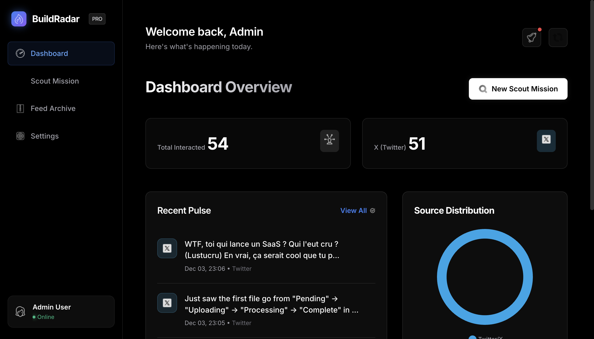
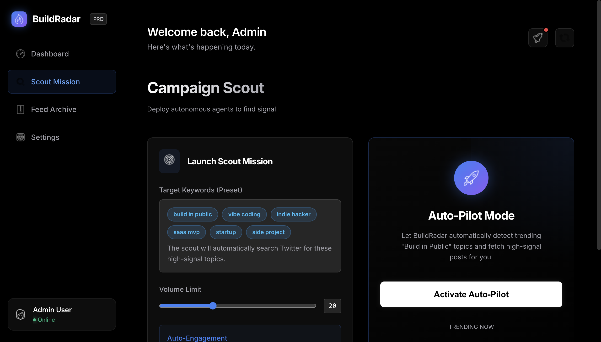
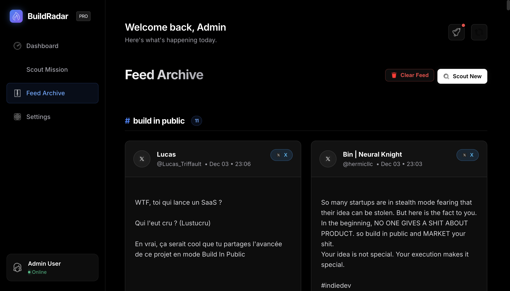

<div align="center">

# 🤖 VibeBot (BuildRadar)
### Autonomous Build-in-Public Engagement Agent

<a href="https://github.com/yourusername/vibebot">
  
</a>
<a href="https://github.com/yourusername/vibebot">
  
</a>
<a href="https://python.org">
  
</a>

<br />

<p align="center">
  <b>Filter noise. Find signal. Engage authentically.</b><br>
  VibeBot is an autonomous intelligence that identifies high-value "Build in Public" content on X (Twitter), filters out spam, and engages using a context-aware Persona Engine.
</p>

</div>

---

##  Overview

The "Build in Public" movement creates a high-velocity stream of content. Developers engage daily, but finding genuine signals amidst the noise is impossible for humans at scale. **VibeBot** solves this by automating the discovery, analysis, and engagement loop.

<table>
  <tr>
    <th>Problem</th>
    <th>VibeBot Solution</th>
  </tr>
  <tr>
    <td>📢 <b>Noise:</b> Too many generic "Day 1 of 100" posts.</td>
    <td>🎯 <b>Signal:</b> Semantic filtering identifies only substantial technical updates.</td>
  </tr>
  <tr>
    <td>🤖 <b>Spam:</b> Bots reply "Great project!" to everything.</td>
    <td>🧠 <b>Authenticity:</b> Claude 3.5 Haiku generates context-aware, technical questions.</td>
  </tr>
  <tr>
    <td>⏳ <b>Time:</b> Manual engagement takes hours/day.</td>
    <td>⚡️ <b>Speed:</b> 24/7 scouting and drafting with human-in-the-loop approval.</td>
  </tr>
</table>

---

##  Key Features

<table>
  <tr>
    <td width="50%" valign="top">
      <h3> The Scout (Discovery)</h3>
      <ul>
        <li><b>Twitter Radar:</b> Scrapes X (Twitter) for high-signal keywords.</li>
        <li><b>Smart Filtering:</b> Ignores memes/images to focus on text-heavy technical posts.</li>
        <li><b>Persistent Browser:</b> Uses Playwright with saved sessions to evade bot detection.</li>
      </ul>
    </td>
    <td width="50%" valign="top">
      <h3> The Vibe Check (Intelligence)</h3>
      <ul>
        <li><b>Persona Engine:</b> Adopts a "casual dev" tone (lowercase, technical slang).</li>
        <li><b>Contextual Memory:</b> Remembers previous interactions to avoid repetitive replies.</li>
        <li><b>LLM Powered:</b> Utilizes Anthropic's Claude 3.5 for high-IQ responses.</li>
      </ul>
    </td>
  </tr>
  <tr>
    <td width="50%" valign="top">
      <h3> The Archivist (Memory)</h3>
      <ul>
        <li><b>Local Persistence:</b> SQLite database stores every tweet, reply, and metric.</li>
        <li><b>Deduplication:</b> SHA-256 hashing ensures we never process the same post twice.</li>
        <li><b>Audit Trail:</b> Full history of `PLANNED` vs `POSTED` interactions.</li>
      </ul>
    </td>
    <td width="50%" valign="top">
      <h3> Dashboard (Control)</h3>
      <ul>
        <li><b>Campaign Manager:</b> Launch targeted scouts for keywords like `#SaaS` or `#IndieHacker`.</li>
        <li><b>Feed View:</b> Tinder-style review interface for approving AI drafts.</li>
        <li><b>Analytics:</b> Real-time charts tracking engagement ROI.</li>
      </ul>
    </td>
  </tr>
</table>

---

##  Tech Stack

<div align="center">

| Category | Technologies |
|----------|--------------|
| **Core** |   |
| **Web** |   |
| **AI & LLM** |  |
| **Browser** |  |
| **Data** |   |
| **Testing** |  |

</div>

---

##  System Architecture

```text
+------------------+       +------------------+       +------------------+
|   User Dashboard |       |   Twitter Scout  |       |   Intelligence   |
|   (FastAPI/Web)  | <---> |   (Playwright)   | <---> | (Claude 3.5 AI)  |
+------------------+       +------------------+       +------------------+
          ^                         |                          |
          |                         v                          v
          |              +----------------------+       +------------------+
          +--------------|   SQLite Database    | <---- |  Browser Context |
                         |   (The Archivist)    |       |   (Playwright)   |
                         +----------------------+       +------------------+
```

> *Note: The system uses a multi-agent architecture where the "Scout" runs asynchronously to populate the database, while the "Interaction Agent" processes the queue.*

---

##  Interface

<div align="center">

| **Control Center** | **Campaign Scout** |
|:---:|:---:|
|  |  |

| **Feed Archive** |
|:---:|
|  |

</div>

---

##  API Documentation

The dashboard is powered by a robust REST API.

| Method | Endpoint | Description | Auth Required |
| :--- | :--- | :--- | :---: |
| `GET` | `/api/scout` | Trigger a manual scouting run | ✅ |
| `GET` | `/api/interactions` | Retrieve paginated feed of interactions | ❌ |
| `POST` | `/api/engage/{id}` | Approve and post a drafted reply | ✅ |
| `GET` | `/settings` | Manage Twitter session cookies | ✅ |

---

##  Database Schema

We use a relational schema optimized for text analysis and metrics tracking.

**Interactions Table**
- `id` (Primary Key): Unique interaction ID
- `platform` (String): 'twitter'
- `content` (Text): The raw post content
- `author` (String): Username of the poster
- `status` (Enum): `NEW`, `ARCHIVED`, `PLANNED`, `POSTED`
- `metrics` (JSON): Snapshot of likes, retweets, replies
- `timestamp` (DateTime): When the post was captured

---

##  Getting Started

### Prerequisites
- Python 3.11+
- Playwright Browsers

### Installation

1. **Clone the Repository**
```bash
git clone https://github.com/yourusername/vibebot.git
cd vibebot
```

2. **Install Dependencies**
```bash
pip install -r requirements.txt
playwright install chromium
```

3. **Configure Environment**
   Create a `.env` file:
   ```bash
   ANTHROPIC_API_KEY=sk-ant-...
   DATABASE_URL=sqlite:///vibebot.db
   ```

4. **Run the Dashboard**
```bash
uvicorn src.web.app:app --reload
```
   
5. **Launch**
   Visit `http://localhost:8000` and start your first Campaign.

---

<div align="center">
  <br />
  <i>Built with ❤️ for the Open Source Community</i>
  <br />
  
</div>
